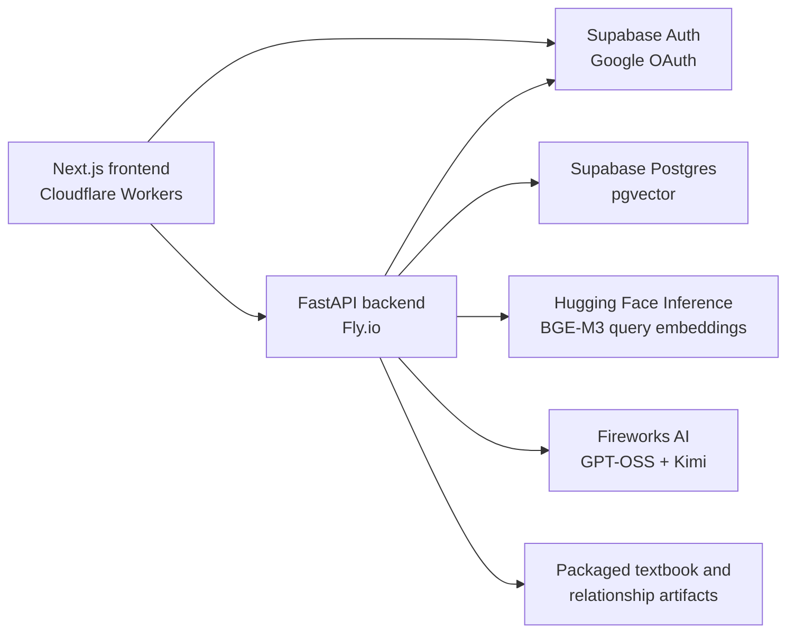

# AI Curriculum Creator

AI Curriculum Creator builds textbook-grounded learning paths for NCERT Class 11
and 12 Physics, Chemistry, and Biology.

A learner selects a subject and enters a learning goal. The application:

1. Clarifies the learner's intent.
2. Retrieves semantically relevant textbook sections.
3. Expands the result through prerequisite and support relationships.
4. Uses an LLM to arrange the selected sections into an ordered curriculum.
5. Designs each module with lesson blocks, an activity, and checkpoint MCQs.
6. Evaluates checkpoint answers and stores section-level learning insights.
7. Uses recent learner insights and reviewed population hotspots when regenerating
   future modules.

## Supported Content

The runtime corpus contains 73 usable chapters from NCERT Class 11 and 12:

- Physics
- Chemistry
- Biology

The following chapters are excluded because their runtime relationship artifacts
are partial or missing:

- Class 12 Chemistry: Haloalkanes and Haloarenes
- Class 12 Chemistry: Alcohols, Phenols and Ethers
- Class 12 Chemistry: Aldehydes, Ketones and Carboxylic Acids
- Class 12 Physics: Alternating Current
- Class 12 Physics: Electromagnetic Waves
- Class 12 Physics: Ray Optics and Optical Instruments

## Runtime Architecture



### Runtime Components

- `frontend/`: Next.js application deployed through OpenNext on Cloudflare Workers.
- `curriculum_engine/`: FastAPI application, retrieval, planning, module design,
  checkpoint evaluation, personalization, and admin services.
- `data/textbook_sources/`: packaged textbook source content.
- `data/relationship_artifacts/`: packaged canonical concepts, section summaries,
  and graph relationships.
- Supabase Postgres: users, plans, modules, checkpoint history, insights,
  hotspots, public response cache, and section vectors.

The textbook and relationship graph remain file-based at runtime. Supabase stores
application state and the pgvector retrieval index.

## User Flow

### Guest Flow

The following operations do not require authentication:

1. Select a subject and enter a learning query.
2. Classify or clarify the intended learning goal.
3. Preview retrieved target sections, prerequisites, and relationship reasoning.
4. Generate and view an ordered curriculum plan.

Guest curriculum plans are stored only in browser `localStorage`. They are not
written to Postgres.

### Authenticated Flow

Authentication is required when a learner opens a module.

1. The frontend signs the learner in with Supabase Google OAuth.
2. On first module creation, the frontend sends the guest plan to the backend.
3. The backend claims and stores that plan under the authenticated Supabase user.
4. The module-design LLM creates lesson blocks, a guided activity, and checkpoint
   MCQs.
5. Checkpoint submissions are evaluated against the stored module design.
6. The backend stores results and reconciled section-level learning insights.

Future module regeneration uses only the learner's latest section insights.

### Curriculum Generation Calls

The runtime uses separate LLM responsibilities:

- **Intent classification:** Fireworks GPT-OSS 120B receives the query and compact
  corpus clues. It confirms a clear intent or returns user-facing interpretations.
- **Curriculum planning:** Fireworks Kimi receives selected sections and
  section-to-section relationship reasoning. It returns an ordered module
  sequence using canonical section IDs.
- **Module design:** Fireworks Kimi receives section summaries, backend-derived
  concepts, relationship reasoning, active population guidance, and latest
  learner insights. It returns lesson blocks, an activity, and checkpoint MCQs.
- **Insight reconciliation:** Fireworks Kimi summarizes current understanding for
  each tested section using current checkpoint evidence and the latest prior
  insight.

## Retrieval

Runtime retrieval combines:

1. BGE-M3 semantic similarity over section embeddings stored in pgvector.
2. Subject filtering for the first semantic-match layer.
3. Bounded evidence scoring from titles, summaries, key terms, and concepts.
4. A maximum of six direct target sections.
5. Graph expansion from selected targets into prerequisites and optional support.

Subject filtering applies only to initial semantic matching. Relationship
expansion may include useful sections from other subjects.

Graph relationship meanings:

- `DEPENDS_ON_UNIT`: hard ordering relationship.
- `TRANSFER_SUPPORTS_UNIT`: optional cross-chapter or cross-subject bridge.
- `RELATED_BY_CONCEPT`: optional reinforcement.
- `TEACHES_CONCEPT`: concepts taught by a section.
- `REQUIRES_CONCEPT`: concepts expected before studying a section.

## Persistence

Supabase Postgres stores:

- authenticated user profiles and pedagogical learner identities
- claimed curriculum plans and ordered modules
- current and versioned module designs
- checkpoint attempts and answers
- latest and historical section-level learning insights
- reviewed misunderstanding hotspots
- section embedding documents and pgvector embeddings
- cached public intent, retrieval, and curriculum responses

Supabase Auth supplies identity. `public.user_profiles.role` is the single source
of truth for application authorization.

Public schema tables have RLS enabled with no browser-facing policies. FastAPI is
the application data gateway and connects directly to Postgres.

## Local Setup

### Requirements

- Python 3.11+
- Node.js 20+
- Supabase project with Google OAuth and pgvector enabled
- Fireworks API key
- Hugging Face token with access to BGE-M3 inference

### Backend

```bash
git clone https://github.com/chandrabs25/curriculum curriculum
cd curriculum

python3 -m venv .venv
source .venv/bin/activate
python -m pip install --upgrade pip
pip install -r requirements-runtime.txt
```

Set runtime environment variables:

```bash
export DATABASE_URL='postgresql://...'
export SUPABASE_URL='https://<project-ref>.supabase.co'
export FIREWORKS_API_KEY='...'
export HF_TOKEN='...'
export CURRICULUM_USE_VECTOR='1'
export CURRICULUM_VECTOR_BACKEND='pgvector'
export CORS_ALLOW_ORIGINS='http://localhost:3000'
```

Use the Supabase **session pooler** connection string when the direct database
hostname is unavailable over IPv4.

Start the API:

```bash
python -m uvicorn curriculum_engine.api:app \
  --host 127.0.0.1 \
  --port 8000 \
  --reload
```

Verify:

```bash
curl http://127.0.0.1:8000/health
```

Expected health fields include:

```json
{
  "ok": true,
  "vector_enabled": true,
  "vector_backend": "pgvector",
  "database_enabled": true
}
```

### Frontend

```bash
cd frontend
npm install
```

Create `frontend/.env.local`:

```bash
NEXT_PUBLIC_API_URL=http://127.0.0.1:8000
NEXT_PUBLIC_SUPABASE_URL=https://<project-ref>.supabase.co
NEXT_PUBLIC_SUPABASE_PUBLISHABLE_KEY=<publishable-key>
```

Start:

```bash
npm run dev
```

Open [http://localhost:3000](http://localhost:3000).

Configure this Supabase Auth redirect URL:

```text
http://localhost:3000/auth/callback
```

## Environment Variables

### Backend Required

| Variable | Purpose |
| --- | --- |
| `DATABASE_URL` | Supabase Postgres connection string |
| `SUPABASE_URL` | Supabase project URL used for JWT verification |
| `FIREWORKS_API_KEY` | Fireworks calls for intent, planning, module design, and insights |
| `HF_TOKEN` | BGE-M3 query embeddings through Hugging Face Inference |
| `CURRICULUM_USE_VECTOR=1` | Enables semantic retrieval |
| `CURRICULUM_VECTOR_BACKEND=pgvector` | Selects Supabase pgvector retrieval |
| `CORS_ALLOW_ORIGINS` | Comma-separated frontend origins |

### Backend Optional

| Variable | Default | Purpose |
| --- | --- | --- |
| `SUPABASE_JWT_SECRET` | unset | Legacy HS256 JWT fallback |
| `FIREWORKS_MAX_RETRIES` | `3` | Transient provider retry count |
| `FIREWORKS_BASE_RETRY_SECONDS` | `1` | Initial retry delay |
| `CURRICULUM_PUBLIC_CACHE` | `1` | Enables public response caching |
| `CURRICULUM_PUBLIC_CACHE_VERSION` | `public-cache-v1` | Invalidates all public cache keys when changed |
| `CURRICULUM_INTENT_CACHE_VERSION` | `intent-v2` | Intent cache version |
| `CURRICULUM_RETRIEVAL_CACHE_VERSION` | `retrieval-v2` | Retrieval cache version |
| `CURRICULUM_PLAN_CACHE_VERSION` | `plan-v2` | Guest plan cache version |

### Frontend Required

| Variable | Purpose |
| --- | --- |
| `NEXT_PUBLIC_API_URL` | FastAPI base URL |
| `NEXT_PUBLIC_SUPABASE_URL` | Supabase project URL |
| `NEXT_PUBLIC_SUPABASE_PUBLISHABLE_KEY` | Browser-safe Supabase publishable key |

Never expose the database password, Fireworks key, Hugging Face token, Supabase
secret key, or service-role key in frontend variables.

## API Surface

### Public Endpoints

| Method | Endpoint | Purpose |
| --- | --- | --- |
| `GET` | `/health` | Runtime, database, vector, and corpus health |
| `GET` | `/api/options` | Available subjects, grades, and chapters |
| `POST` | `/api/intent/classify` | Confirm or clarify a learning query |
| `POST` | `/api/retrieval/preview` | Retrieve and expand textbook sections |
| `POST` | `/api/curriculum/plan` | Generate an unsaved guest curriculum plan |

### Authenticated Learner Endpoints

All require `Authorization: Bearer <supabase-access-token>`.

| Method | Endpoint | Purpose |
| --- | --- | --- |
| `GET` | `/api/me/profile` | Current user profile and database role |
| `GET` | `/api/me/plans` | Current user's persisted plans |
| `GET` | `/api/me/section-insights` | Latest insights for selected sections |
| `GET` | `/api/curriculum/plans/{plan_id}` | Load an owned plan |
| `POST` | `/api/modules/design` | Claim a guest plan if needed and design a module |
| `GET` | `/api/curriculum/plans/{plan_id}/modules/{module_id}/design` | Load a stored module design |
| `POST` | `/api/checkpoints/submit` | Evaluate stored checkpoint MCQs |
| `GET` | `/api/curriculum/plans/{plan_id}/modules/{module_id}/checkpoint/latest` | Load latest checkpoint result |

### Admin Endpoints

Admin endpoints require `user_profiles.role = 'admin'`.

- `/api/admin/check`
- `/api/admin/dashboard`
- `/api/admin/learners`
- `/api/admin/learners/{user_id}`
- `/api/admin/hotspots`
- `/api/admin/hotspots/{hotspot_id}`
- `/api/admin/content/stats`
- `/api/admin/checkpoint-analytics`

Grant admin access:

```sql
update public.user_profiles
set role = 'admin'
where email = 'admin@example.com';
```

## Deployment

### Backend: Fly.io

Runtime configuration is in `fly.toml`.

Set secrets:

```bash
fly secrets set \
  DATABASE_URL='postgresql://...' \
  FIREWORKS_API_KEY='...' \
  HF_TOKEN='...'
```

Deploy:

```bash
fly deploy
```

Verify:

```bash
curl https://<fly-app>.fly.dev/health
```

### Frontend: Cloudflare Workers

Runtime configuration is in `frontend/wrangler.jsonc`.

```bash
cd frontend
npm install
npm run deploy
```

The deployed frontend origin must be present in backend
`CORS_ALLOW_ORIGINS`, and its `/auth/callback` URL must be allowed in Supabase
Auth redirect settings.

## Runtime Operations

### Rebuild And Upload Section Embeddings

Run this after canonical concepts, section relationships, or embedding text
changes:

```bash
source .venv/bin/activate

pip install -r requirements.txt
python scripts/download_embedding_model.py
python scripts/build_retrieval_index.py --force
python scripts/import_pgvector_index.py --skip-schema
```

The full requirements are needed only for local index building because that
process loads `sentence-transformers`. The running API uses Hugging Face
Inference for query embeddings and does not load the embedding model locally.

The import upserts all section vectors. `/health` should report the same
`section_embedding_documents` count as the local index.

### Invalidate Public Caches

Use after retrieval, graph, prompt, or model changes:

```sql
truncate table public.public_response_cache;
```

Then bump the deployed cache version:

```bash
fly secrets set CURRICULUM_PUBLIC_CACHE_VERSION=public-cache-v2
```

### Detect Misunderstanding Hotspots

Checkpoint evidence is aggregated by section, concept, and misconception tag.
Candidates do not affect modules until an admin reviews and activates them.

```bash
python scripts/detect_hotspots.py
```

Use deterministic summaries without an LLM call:

```bash
python scripts/detect_hotspots.py --no-llm
```

### Reset Disposable Learning Data

For demo environments where plans and checkpoints can be discarded:

```sql
begin;
delete from public.curriculum_plans;
truncate table public.section_misunderstanding_hotspots;
truncate table public.public_response_cache;
commit;
```

This preserves users, textbook content, relationship artifacts, and section
embeddings.

## Verification

Backend:

```bash
source .venv/bin/activate
python -m unittest discover -s tests -v
```

Frontend:

```bash
cd frontend
npm run build
```

Before a deployment, verify:

1. `/health` reports `ok`, pgvector enabled, and database connectivity.
2. A guest can classify intent, preview retrieval, and create a curriculum.
3. Opening a module requires login and persists the guest plan.
4. Module design returns lesson content, an activity, and checkpoint MCQs.
5. Checkpoint submission creates a result and section insight.
6. A normal learner cannot access admin routes.
