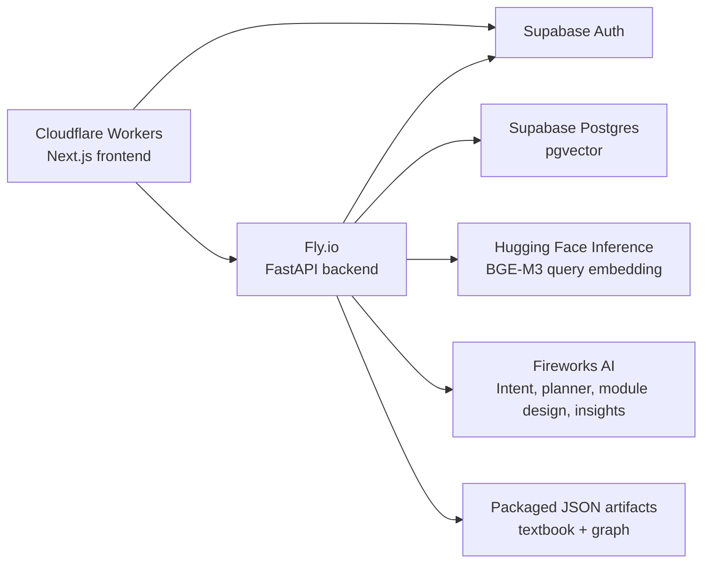

# Scaling Report: AI Curriculum Creator

This report explains how the current project design affects scaling across
users, content, retrieval quality, LLM usage, personalization, persistence, and
deployment.

The runtime app has four main responsibilities:

1. Retrieve textbook-grounded sections for a learner query.
2. Use graph relationships to build a learning path.
3. Use LLM calls to plan curricula and design modules.
4. Persist learner-specific module/checkpoint/insight data.

Scaling pressure comes from three directions:

- more users generating plans and modules
- more textbook content and graph relationships
- more personalization and learning history per learner

## Current Runtime Architecture

## Scaling Axes

| Scaling Axis | What Increases | Main Risk |
| --- | --- | --- |
| User traffic | More concurrent queries, plans, modules, checkpoints | LLM latency/cost and backend concurrency |
| Corpus size | More books, chapters, sections, concepts | Retrieval noise, graph size, larger artifacts |
| Personalization | More insights per learner | Larger prompts, slower profile lookup |
| Assessment usage | More checkpoint attempts | Database growth and hotspot aggregation cost |
| Admin analytics | More learners and attempts | Expensive joins and dashboard queries |
| Deployment regions | Users farther from backend/database | Network latency |

## Design Decision Impact

### 1. File-Based Textbook And Relationship Artifacts

The app keeps textbook source JSON and relationship artifacts in the deployed
backend image. This is good for the current scale.

Benefits:

- Fast local reads after process startup.
- No database lookup needed for every section summary or relationship.
- Easy to audit generated artifacts.
- Simple deployment: artifacts ship with backend code.

Scaling limits:

- Large artifact files increase Docker image size.
- Updating content requires redeploying the backend.
- Multiple backend machines each load their own copy.
- Very large corpora could increase startup time and memory usage.

Current risk level: low to medium.

Recommended path:

- Keep this design while the corpus is NCERT Class 11/12 PCB.
- Move source content/artifacts to object storage or Postgres only when content
  updates become frequent or corpus size grows beyond a few thousand sections.
- Keep graph artifacts versioned even if storage changes.

### 2. pgvector For Runtime Retrieval

The current runtime uses Supabase Postgres with pgvector for section vector
search. Query embeddings are generated through Hugging Face Inference.

Benefits:

- Retrieval is centralized and durable.
- Backend instances do not need local `.npy` vector files.
- Subject, grade, and chapter filters can be applied inside database retrieval.
- Scaling reads is easier than shipping flat-file indexes to each server.

Scaling limits:

- Every vector query depends on Hugging Face embedding latency.
- pgvector performance depends on index type, row count, and query filters.
- Supabase connection pooling matters when backend traffic grows.
- If the section table grows into tens/hundreds of thousands of rows, index
  tuning becomes important.

Current risk level: medium.

Recommended path:

- Keep pgvector as the source of truth for runtime retrieval.
- Cache query embeddings or full retrieval results for repeated public queries.
- Monitor retrieval latency separately from LLM latency.
- Add database indexes for common filters: `subject`, `grade`, `chapter_id`.
- For larger corpora, benchmark IVFFlat/HNSW index behavior and recall.

### 3. Bounded Retrieval Before Planning

The current design retrieves a broader semantic candidate pool, then limits the
planner to a small number of selected target sections plus graph-expanded
prerequisites/support.

Benefits:

- Prevents prompt bloat.
- Prevents one vague query from sending too many sections to the planner.
- Improves LLM focus and reduces lost-in-the-middle risk.
- Keeps curriculum generation costs more predictable.

Scaling limits:

- If ranking is too strict, the curriculum may miss useful sections.
- If ranking is too loose, unrelated sections enter the planner.
- Retrieval quality becomes a major determinant of curriculum quality.

Current risk level: medium.

Recommended path:

- Maintain golden query sets for each subject.
- Track `Recall@6`, irrelevant section rate, and subject leakage rate.
- Keep optional support separate from required path sections.
- Use diagnostics to explain why each selected/rejected section was handled that
  way.

### 4. Generated Knowledge Graph

The graph gives the app structure beyond vector similarity:

- `DEPENDS_ON_UNIT`
- `TRANSFER_SUPPORTS_UNIT`
- `RELATED_BY_CONCEPT`
- `TEACHES_CONCEPT`
- `REQUIRES_CONCEPT`

Benefits:

- Reduces dependence on the LLM to infer prerequisites from scratch.
- Allows curriculum planning to respect hard dependencies.
- Supports remediation and “study next” recommendations.
- Makes retrieval auditable through section/concept IDs.

Scaling limits:

- Graph quality depends on concept normalization quality.
- Bad canonical merges can create bad prerequisite links.
- Too many soft links can bloat planner context.
- Relationship artifacts need rebuild discipline after concept changes.

Current risk level: medium.

Recommended path:

- Keep hard dependencies and optional support separated in every API contract.
- Add graph coverage metrics:
  - required concepts taught somewhere
  - unresolved prerequisites
  - dependencies per section
  - cross-subject transfer links per section
- Continue using reviewed concept merges, not fuzzy runtime joins.

### 5. Two-Stage LLM Flow

The app separates curriculum generation into:

1. First LLM call: order sections into modules.
2. Second LLM call: design each module with lesson blocks, activity, and MCQs.

Benefits:

- The first call stays compact and focused on ordering.
- The second call can use module-specific concepts and insights.
- Module designs can be generated lazily only when a learner opens a module.
- Failed module generation does not require regenerating the whole curriculum.

Scaling limits:

- A curriculum with many modules can require many LLM calls over time.
- Module design latency is visible when the user opens a module.
- If module designs are regenerated too often, cost rises quickly.

Current risk level: medium to high.

Recommended path:

- Persist module designs and reuse them unless `force_regenerate=true`.
- Cache public curriculum plans but not learner-personalized module designs.
- Track:
  - LLM calls per curriculum
  - average planner latency
  - average module design latency
  - cost per generated curriculum
  - module regeneration rate

### 6. Public Cache For Intent, Retrieval, And Guest Plans

The app caches public flows for repeated queries.

Benefits:

- Reduces repeated LLM calls for common topics like gravity/photosynthesis.
- Reduces Fireworks overload exposure.
- Improves perceived speed.
- Makes demo behavior more stable.

Scaling limits:

- Cache keys must include subject, grade, prompt version, model version, and
  artifact version.
- Stale cache can hide retrieval or prompt fixes.
- Personalized calls should not use public cache.

Current risk level: medium.

Recommended path:

- Keep public cache only for non-user-specific flows.
- Version cache keys aggressively after prompt/retrieval/graph changes.
- Add cache hit/miss metrics.
- Provide an admin/manual cache invalidation operation.

### 7. Guest Plan Flow

Curriculum plans are public/guest-accessible and stored in browser localStorage
until the learner opens a module. Authentication begins at module creation.

Benefits:

- Lower onboarding friction.
- Fewer abandoned users before seeing value.
- Public plan generation can be cached.
- Database does not fill with anonymous plans.

Scaling limits:

- Guest plans disappear if browser storage is cleared.
- Plan claiming logic must validate ownership carefully.
- Large plan payloads in localStorage can become awkward.

Current risk level: low to medium.

Recommended path:

- Keep guest plans local for now.
- Persist only when the user starts learning a module.
- Keep guest plan payload compact.
- Never store private learner insights in localStorage.

### 8. Supabase Auth And User-Owned Data

Supabase Auth identifies users. The backend owns app authorization through
`user_profiles.role`.

Benefits:

- Identity is delegated to Supabase.
- Backend remains the app data gateway.
- Learner data is scoped by authenticated user ID.
- Role changes happen in one database table.

Scaling limits:

- Every protected request needs token verification and profile lookup/upsert.
- Admin queries can become expensive as learner/checkpoint data grows.
- Role/profile sync must avoid overwriting admin roles.

Current risk level: medium.

Recommended path:

- Cache verified auth claims briefly if request volume grows.
- Keep role authorization database-owned.
- Add indexes on learner-owned tables by `learner_id`, `curriculum_plan_id`,
  and timestamps.
- Keep admin dashboards paginated.

### 9. Learner Section Insights

The app stores latest and historical section-level insights from checkpoint
evaluation.

Benefits:

- Personalization stays tied to section IDs.
- Latest insight can tailor future module generation.
- Historical insight remains available for audit/debugging.

Scaling limits:

- Prompt bloat if too many insights are sent.
- Conflicting or stale insights can harm personalization.
- Insight generation adds another LLM call after checkpoint submission.

Current risk level: medium.

Recommended path:

- Send only latest insights for sections in the current module.
- Keep old insights for history, not personalization.
- Track insight generation failures separately from deterministic scoring.
- Consider async insight reconciliation if checkpoint latency becomes too high.

### 10. Population Hotspot Detection

Hotspot detection uses checkpoint answers, not old individual insights. Active
hotspots become teaching overlays for future module designs.

Benefits:

- Finds recurring misunderstandings across learners.
- Avoids mutating textbook source artifacts.
- Versioned evidence windows prevent old failures from permanently polluting new
  designs.

Scaling limits:

- Aggregation over checkpoint answers grows with usage.
- Admin review workflow becomes important before guidance affects learners.
- Bad hotspot guidance could systematically bias module generation.

Current risk level: medium.

Recommended path:

- Run hotspot detection as a scheduled or manual batch job.
- Index checkpoint answers by section, concept, misconception tag, and attempt
  timestamp.
- Keep candidate hotspots inactive until reviewed.
- Store activation time and evidence window boundaries.

### 11. Backend On Fly.io

The backend runs as a FastAPI service on Fly.io.

Benefits:

- Simple deployment for Python backend.
- Can scale machine size/count as traffic increases.
- Good fit for long-running API service compared with serverless Python cold
  starts.

Scaling limits:

- One region means distant users have higher latency.
- LLM calls can tie up request workers.
- CPU/memory limits matter when artifacts are large.

Current risk level: medium.

Recommended path:

- Track p95 latency for each endpoint.
- Separate LLM latency from retrieval/database latency.
- Add more machines or larger machines when concurrent module generation grows.
- Consider background jobs for slow non-interactive work.

### 12. Frontend On Cloudflare Workers

The frontend is deployed through OpenNext on Cloudflare Workers.

Benefits:

- Fast global frontend delivery.
- Static and dynamic routes run close to users.
- Good fit for lightweight authenticated UI.

Scaling limits:

- Backend remains the latency bottleneck for API calls.
- Runtime environment variables must be configured correctly.
- Browser-local guest plans are device-specific.

Current risk level: low.

Recommended path:

- Keep frontend mostly thin.
- Avoid moving curriculum logic into the frontend.
- Ensure CORS and Supabase redirect URLs are maintained per deployed origin.

## Main Bottlenecks To Watch

### Near-Term Bottlenecks

1. Fireworks LLM latency and overload.
2. Hugging Face query embedding latency.
3. Retrieval relevance for broad/ambiguous queries.
4. Public cache staleness after prompt/retrieval changes.
5. Module design call count as learners open multiple modules.

### Medium-Term Bottlenecks

1. Admin analytics over growing checkpoint data.
2. Hotspot aggregation over many attempts.
3. Graph quality as corpus expands.
4. Database connection limits under concurrent traffic.
5. Docker image size if file artifacts grow.

### Long-Term Bottlenecks

1. Multi-corpus support across many boards/books.
2. Region-aware backend/database placement.
3. Cost control across LLM and embedding providers.
4. Versioning content, graph, prompts, and module designs together.

## Metrics To Track

### Product Quality

| Metric | Purpose |
| --- | --- |
| Retrieval Recall@6 | Measures whether expected sections are selected |
| Subject leakage rate | Detects unrelated subject matches |
| Planner invalid ID rate | Ensures LLM respects ID contracts |
| Module design validation failure rate | Tracks schema/grounding problems |
| Checkpoint MCQ validity rate | Ensures MCQs map to sections/concepts |
| Insight reconciliation success rate | Measures personalization pipeline reliability |

### System Performance

| Metric | Purpose |
| --- | --- |
| p50/p95 `/api/intent/classify` latency | Intent UX health |
| p50/p95 `/api/retrieval/preview` latency | Retrieval UX health |
| p50/p95 `/api/curriculum/plan` latency | Planner health |
| p50/p95 `/api/modules/design` latency | Module opening UX |
| p50/p95 `/api/checkpoints/submit` latency | Assessment UX |
| Fireworks error rate | Provider health |
| Hugging Face embedding error rate | Retrieval dependency health |
| Supabase query latency | Database health |

### Cost And Cache

| Metric | Purpose |
| --- | --- |
| Public cache hit rate | Measures cache effectiveness |
| LLM calls per completed curriculum | Controls cost |
| Module regenerations per learner | Detects runaway personalization cost |
| Average tokens per planner call | Prompt bloat control |
| Average tokens per module design call | Prompt bloat control |

## Recommended Scaling Roadmap

### Phase 1: Make Current Scale Observable

- Add structured logs for endpoint duration and provider duration.
- Add request IDs across frontend/backend.
- Track cache hit/miss.
- Add a small golden retrieval evaluation set.
- Add CI that runs backend tests and frontend build.

### Phase 2: Make Cost Predictable

- Cache repeated public intent/retrieval/plan calls.
- Persist module designs and avoid repeated regeneration.
- Cap planner sections and optional support buckets.
- Add LLM call counters per plan/module.

### Phase 3: Make Learning Data Scalable

- Add database indexes for checkpoint attempts/answers/insights.
- Paginate admin views.
- Run hotspot detection as a batch job.
- Keep only latest insights in module design prompts.

### Phase 4: Make Corpus Expansion Safe

- Version artifacts, embeddings, prompt versions, and cache keys together.
- Add graph coverage audits to every artifact rebuild.
- Benchmark pgvector retrieval as section count grows.
- Consider moving artifacts to object storage if backend image size becomes a
  deployment problem.

## Key Design Principles For Scaling

1. Keep the LLM away from raw full-corpus context.
2. Let retrieval and graph logic decide what enters the prompt.
3. Keep hard dependencies separate from optional support.
4. Keep public cached flows separate from personalized flows.
5. Store learner personalization on the backend, not in frontend state.
6. Use latest individual insight for personalization, not full history.
7. Use population checkpoint evidence for hotspots, not old learner insights.
8. Make every major architecture change measurable with a pass/fail check.

## Summary

The current architecture is reasonable for an early production/demo system. The
largest scaling risks are not raw compute; they are LLM cost/latency, retrieval
quality, cache invalidation, and growth of personalized learning data.

The most important scaling choice already made is the split between:

- deterministic retrieval/graph expansion
- compact curriculum planning
- module-specific LLM design
- persisted learner insights

That separation keeps the system controllable. To scale safely, the next step is
to make quality and cost visible through evaluation metrics, logs, cache metrics,
and CI checks.
